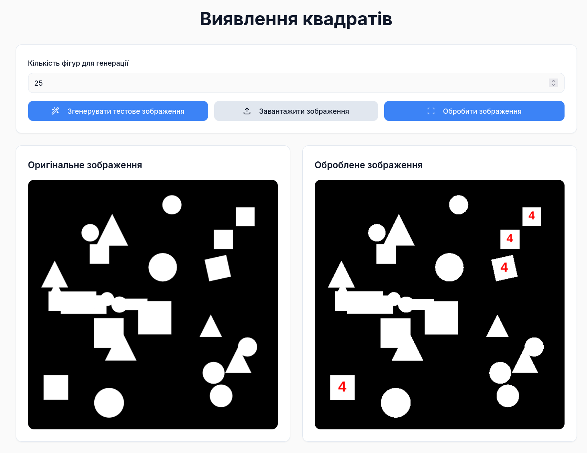
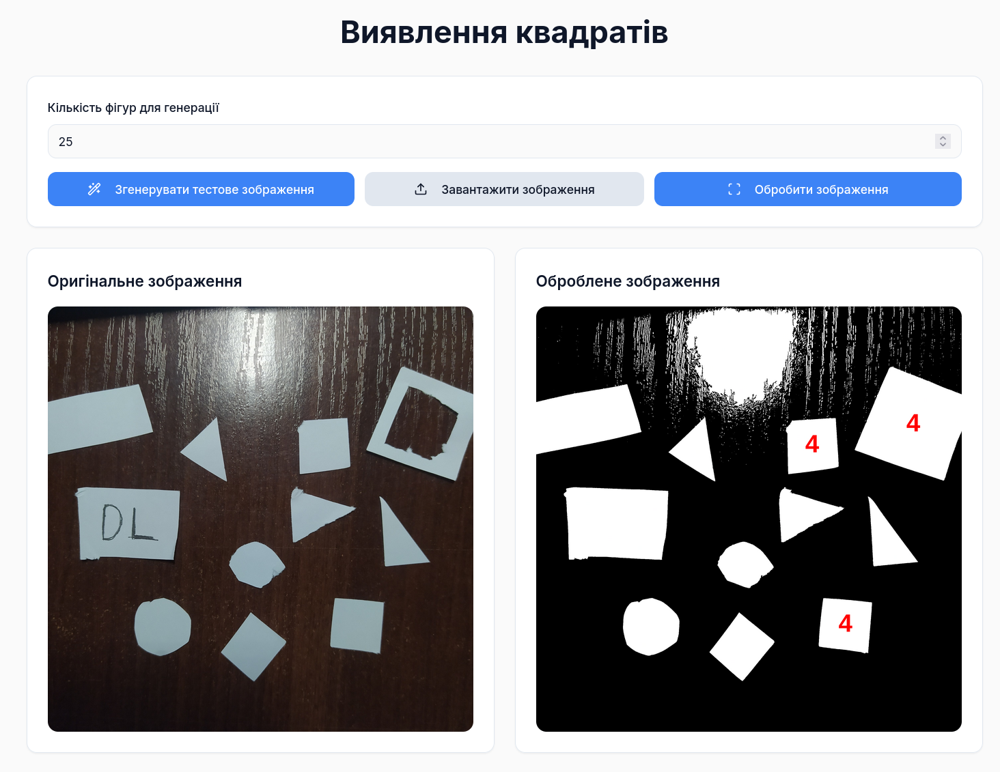

# Square Detection

A web-based computer vision application for detecting and analyzing square shapes in binary images using contour analysis and shape recognition algorithms.

## Description

This project implements a square detection algorithm that processes binary images to identify square shapes among various geometric objects. It solves the challenge of accurately distinguishing squares from other shapes (circles, triangles, rectangles) by analyzing geometric properties such as compactness, aspect ratio, and fill ratio.

## Features

- **Binary Image Processing**: Converts color images (PNG, JPG, BMP) to binary format with proper black/white standardization
- **Square Detection Algorithm**: Identifies squares using multi-factor analysis:
    - Compactness ratio (0.7-0.85)
    - Aspect ratio (0.85-1.15)
    - Fill ratio (>85%)
- **Multiple Input Methods**:
    - Upload custom images (BMP, PNG, JPG)
    - Generate test images with random shapes
- **Visual Feedback**: Marks detected squares with numbered labels
- **Real-time Processing**: Instant visualization of detection results

## Screenshots

### Test Image Generation

*Generated test image with random shapes including squares, circles, triangles, and rectangles*

### Image Upload Processing

*Custom BMP/PNG/JPG image converted to binary with square detection applied*

## Technology Stack

### Frontend
- **React 18.3** - UI component library
- **TypeScript** - Type-safe JavaScript
- **Vite** - Fast build tool and dev server
- **Tailwind CSS** - Utility-first CSS framework
- **shadcn/ui** - High-quality React components

### Libraries
- **React Router DOM** - Client-side routing
- **TanStack Query** - Data fetching and state management
- **Lucide React** - Icon library
- **Sonner** - Toast notifications

### Build Tools
- **TypeScript Compiler** - Static type checking
- **ESLint** - Code linting
- **PostCSS** - CSS processing

## Directory Structure

```
src/
├── components/
│   ├── ui/                    # Reusable UI components (shadcn/ui)
│   │   ├── button.tsx
│   │   ├── card.tsx
│   │   ├── input.tsx
│   │   └── ...
│   └── ImageProcessor.tsx     # Main image processing component
├── pages/
│   ├── Index.tsx              # Home page
│   └── NotFound.tsx           # 404 page
├── hooks/
│   └── use-mobile.tsx         # Mobile detection hook
├── lib/
│   └── utils.ts               # Common utilities
├── App.tsx                    # Root application component
├── main.tsx                   # Application entry point
└── index.css                  # Global styles and design tokens
```

## Installation and Running

1. **Clone the repository**
   ```bash
   git clone <GIT_URL>
   cd <PROJECT_NAME>
   ```

2. **Install dependencies**
   ```bash
   npm install
   ```

3. **Start development server**
   ```bash
   npm run dev
   ```

4. **Open in browser**
   ```
   Navigate to http://localhost:5173
   ```

### Build for Production

```bash
npm run build
```

The production-ready files will be in the `dist/` directory.


## License

MIT License - see [LICENSE](LICENSE) file for details.